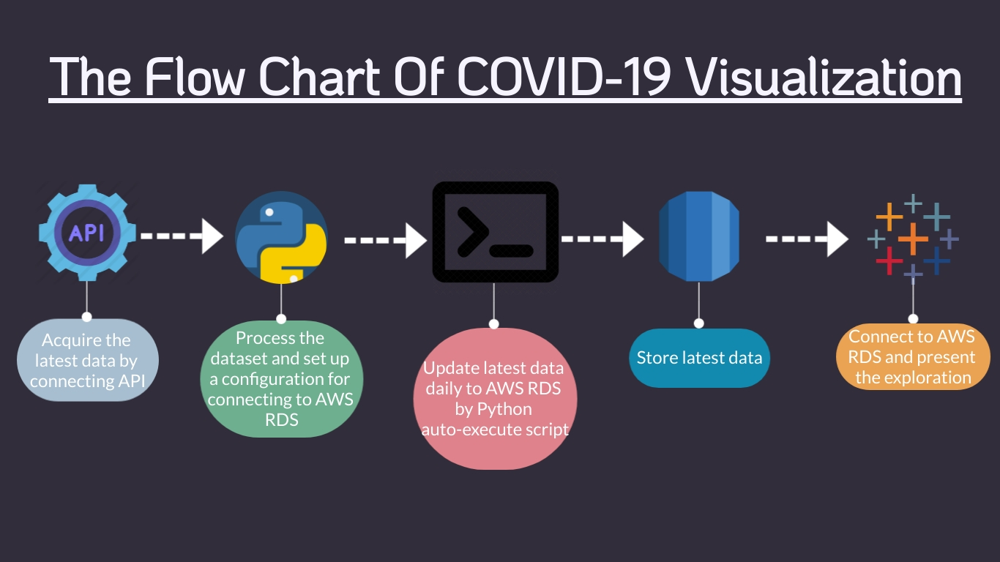

# COVID-19 Global Overview Project
__Motivation__: COVID-19 is a global enemy and it becomes severe daily. As a data analyst, I would love to see the global COVID19 overview and also the trend. Moreover, I want to assemble several techniques (AWS, SQL, Python, Tableau) in one project.

In this project, I combined API, AWS RDS, MYSQL, auto-execute script (python), and Tableau to see the latest and updated data.

Below is my flow chart

__Step 1. Connected to the API__\
The API I used is from [smartable](https://developer.smartable.ai/api-details#api=coronavirus&operation=news). This API is free and contains simple data. After I acquired the API link and key, I used python to access and store the dataset.

__Step 2. Data processing__\
In this phase, I used python to do two things.\
First, I transformed the dataset from the JSON format into a data frame.\
Second, since I want to store my data frame to AWS RDS, I build a configuration to allow my python program to communicate to the AWS server.

__Step 3. Auto Update__\
Since the API will update the lastest COVID19 data daily, I also want to do the same thing to my database. Therefore, I create a python script to auto-execute my program. If you are interested, you can see more detail in the auto_execute.py file.

__Step 4. AWS RDS__\
This is a huge part of the project. Be honest, I haven't used AWS RDS before this project. Therefore, I did a lot of research and handled tons of obstacles. I am glad I finally made it and the process is extremely fun. 

__Step 5. Visualization__\
Finally, Used Tableau to connect AWS RDS and visualized the data.\ 
I used below functions to make my dashboard interactive and tidy:
* 1. Parameter (Metric and Date granularity control)
* 2. Calculated field (Rank)
* 3. Flag icon (make the map vivid)
I used to put all worksheets to my dashboard. However, it makes the dashboard hard to read. This time, I only show limited content. And it makes the dashboard readable and informative.

You can see my dashboard [here](https://public.tableau.com/views/Covid19GlobalOverview/COVID-19WorldwideDashboard?:language=en&:display_count=y&publish=yes&:origin=viz_share_link).

<noscript></noscript><object class='tableauViz'  style='display:none;'><param name='host_url' value='https%3A%2F%2Fpublic.tableau.com%2F' /> <param name='embed_code_version' value='3' /> <param name='site_root' value='' /><param name='name' value='Covid19GlobalOverview&#47;COVID-19WorldwideDashboard' /><param name='tabs' value='no' /><param name='toolbar' value='yes' /><param name='static_image' value='https:&#47;&#47;public.tableau.com&#47;static&#47;images&#47;Co&#47;Covid19GlobalOverview&#47;COVID-19WorldwideDashboard&#47;1.png' /> <param name='animate_transition' value='yes' /><param name='display_static_image' value='yes' /><param name='display_spinner' value='yes' /><param name='display_overlay' value='yes' /><param name='display_count' value='yes' /><param name='language' value='en' /><param name='filter' value='publish=yes' /></object>

